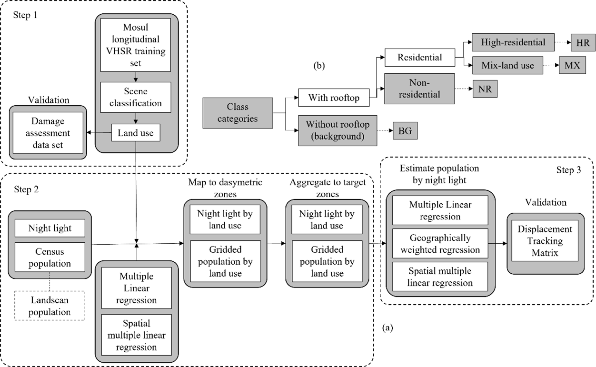

# Displace, Return, and Reconstruct: Population Movement and Resilience to Instability

Reliable information about large population displacement and return resulting from wars and armed conflicts is fundamental to plan and deliver humanitarian aids and post-war recovery services. However, field data collection is usually not possible due to the potential risks. Remote sensing could solve this problem. On the one hand, Longitudinal land use products derived from very high-resolution images distinguish human residential areas from other land cover (e.g., vegetation) and land use (e.g., industrial zones) and recognizes potential changes due to damage or development. On the other hand, nightlight reveals the presence and density of the population. In this project, we assessed the potential of remote sensing to estimate the population displacement and return before and after a conflict. 

This project was part of a grant funded by Minerva Research Initiative and the Army Research Office (PI: [Dr. Jim Walsh](https://jamesigoewalsh.com/), Co-PI: [Dr. Jean-Claude Thill](https://pages.charlotte.edu/jean-claude-thill/), [Dr. Jacob Aronson](https://cidcm.umd.edu/facultyprofile/aronson/jacob)).

## Table of Contents

- [Technologies Used](#technologies-used)
- [Features](#features)
- [Getting Started](#getting-started)
- [Folder Structure](#folder-structure)
- [Usage](#usage)
- [Examples](#examples)
- [Documentation](#documentation)
- [Contributing](#contributing)
- [License](#license)
- [Acknowledgments](#acknowledgments)
- [Contact](#contact)

## Technologies Used

- Python 3.9
- R version 4.2.3 (2023-03-15 ucrt)
- Matlab 2020b
- Wget

## Features
- The project involves performing high-resolution landuse classification using deep learning techniques.
- A unique training dataset is created specifically for an urban area in a Middle Eastern country.
- Geospatial applications typically handle raster and vector data types, and integrating these data types can be challenging. This project addresses this challenge by providing dasymetric solutions within the repository.
- By incorporating powerful spatial statistical models, the project enhances the remote sensing of population displacement, adding valuable insights to the analysis.



## Getting Started
To get started with the Remotely-Sensed-Population-Displacement repository, follow these steps:

1. Clone the repository: `git clone https://github.com/behnamnkp/Behavioral-Interventions.git`
2. Organize directories as in the folder structure
3. Make sure you use the right versions of Python and R
4. Install the required dependencies in `requirements.txt`
5. Configure the flags and paths in the `.config.json` file

## Folder Structure
```
📁 BI
├── 📁 documents
├── 📁 temp
├── 📁 codes
│   ├── 📁 old
│   ├── main.py
│   ├── main.R
│   ├── bi.py
│   ├── read_data.py
│   ├── plot.py
│   ├── resample_data.py
│   ├── functions.R
│   ├── epidemic_weeks.R
├── 📁 src
│   ├── 📁 d4a
│   ├── 📁 census
│   ├── 📁 safegraph
│   ├── 📁 psu_calendar
│   ├── 📁 environment
│   ├── 📁 vaccination
│   ├── 📁 disease_incidence
│   ├── 📁 traffic_cameras
│   ├── 📁 safegraph_home_panel_summaries
│   ├── 📁 safegraph_social_distancing
├── 📁 output             
│   ├── 📁 exploratory_analysis   
│   ├── 📁 timeseries_regression      
│   └── 📁 reports  
└── 📄 config.json
└── 📄 README.md
└── ...
```

## Usage
Once you organize files and directories, you will be able to run the code. Code creates visualizations of uptake, persistence, and waning of behavioral interventions ove time, and conducts time series regression analysis.

## Examples

We test our approach in Mosul, Iraq during a five years (2014-2018) of armed conflict.


## Documentation

A manuscript of the methodology is currently under review at [Remote Sensing of Environment](https://drive.google.com/file/d/1bn6aB1neviTIUqsm3jNDG1T3XPRgK0SC/view?usp=sharing). 

## Contributing

To contribute, please follow these steps:

1. Fork the repository
2. Create a new branch: `git checkout -b feature/new-feature`
3. Make your changes and commit them: `git commit -am 'Add new feature'`
4. Push the changes to your forked repository: `git push origin feature/new-feature`
5. Submit a pull request

Code of conduct: This repository and the manuscript are not publicly accessible at the moment, with the permission of the co-authors, this version is available exclusively to readers with access to this GitFront repository. Once the review process is complete and the manuscript is officially published or becomes publicly accessible, it will be made available to a broader audience. Until then, please note that access to the manuscript is limited to those who have access to this specific GitFront repository.


## License

This project is not publicly licensed.

## Acknowledgments

This project was funded by [Minerva Research Initiative and the Army Research Office](https://minerva.defense.gov/).

## Contact

For any questions, suggestions, or feedback, please contact me:

- Email: bzn5190@psu.edu
- Twitter: @behnam_nkp